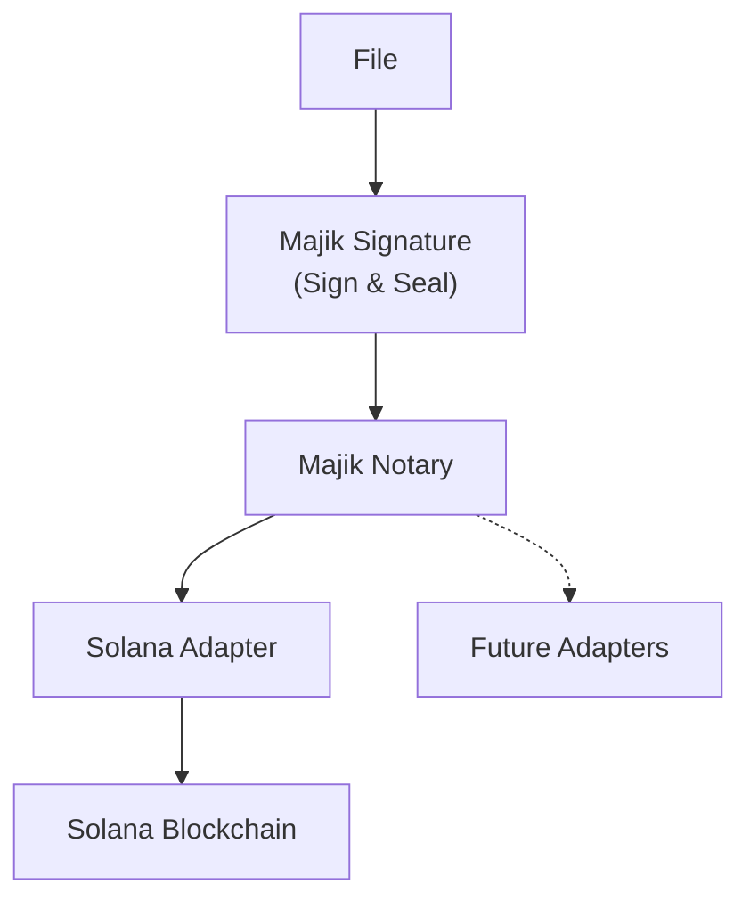

# Majik Notary
> Chain-agnostic blockchain notarization and proof-of-existence for sealed Majik Signature files.

[](https://thezelijah.world) 

   [](https://opensource.org/licenses/Apache-2.0) 

---

> [!IMPORTANT]
> **Early Access**
>
> Majik Notary is currently under active development.
>
> While the core notarization engine is already functional, the public developer APIs and end-user workflows have **not yet been officially released**.
>
> This documentation focuses on the current architecture and implementation rather than the final public SDK.

**Majik Notary** provides independently verifiable blockchain proof for files sealed with [@majikah/majik-signature](https://www.npmjs.com/package/@majikah/majik-signature).

Its architecture is intentionally **blockchain-agnostic**, allowing multiple blockchain adapters to exist behind a common notarization model.

The current implementation uses the **Solana blockchain** via the SPL Memo Program. Solana was selected as the initial blockchain because its combination of high throughput, fast confirmations, and extremely low transaction costs makes it well suited for large-scale document notarization while maintaining independent public verifiability.

The architecture is designed to accommodate additional blockchain adapters without requiring changes to application code or the sealed file format.

Unlike `@majikah/majik-signature`, this package does **not** perform cryptographic signing. Its responsibility is solely to create and verify blockchain proof for already sealed files.

---

## Features

- Chain-agnostic notarization architecture
- Proof-of-existence for sealed files
- Independent integrity verification
- Deterministic blockchain memo generation
- On-chain verification
- Solana adapter (current implementation)
- Supports Solana Devnet and Mainnet
- Built on `@solana/kit`
- Keeps `@majikah/majik-signature` completely blockchain-independent

---

## Installation

```bash
npm install @majikah/majik-notary
```

---

## Architecture

Majik Signature intentionally separates cryptographic signing from blockchain notarization.



**Majik Notary** acts as a blockchain abstraction layer.

Today, Majik Notary includes a Solana adapter. Its architecture allows additional blockchain adapters to be added without requiring changes to `@majikah/majik-signature` or the sealed file format.

This separation keeps the signing engine portable while allowing blockchain support to evolve independently.

---

## How it works

When a sealed file is notarized:

1. The file's **seal hash** is extracted.
2. A deterministic memo is built.
3. A Solana transaction containing the memo is created.
4. The transaction is submitted.
5. After confirmation, a chain anchor is embedded back into the file.

No file contents are uploaded.

Only a deterministic cryptographic digest is anchored on-chain.

---

## Example API (Subject to Change)

```ts
import { MajikNotary } from "@majikah/majik-notary";

const { blob, anchor } = await MajikNotary.notarize(
    sealedFile,
    signer,
    rpc
);
```

The returned file contains an embedded blockchain anchor that can later be verified independently.

---

## Verifying an Anchor

Verification does **not** trust the embedded anchor alone.

Instead it:

- derives the expected memo from the seal hash (SHA3-512)
- fetches the actual Solana transaction
- compares the on-chain memo
- confirms the transaction reached a confirmed or finalized state

```ts
const result = await MajikNotary.verifyOnChain(anchor, rpc);

console.log(result.valid);
```

This allows third parties to independently validate the blockchain proof.

---

## Building Memos

The memo format is owned by `@majikah/majik-signature`.

Majik Notary simply delegates to it.

```ts
const memo = MajikNotary.buildMemo(sealHash);
```

This guarantees every implementation produces identical deterministic memo strings.

---

## RPC Client

A helper is included for creating Solana RPC clients.

```ts
import { createRpcClient } from "@majikah/majik-notary";

const rpc = createRpcClient("devnet");
```


---

## Security

Majik Notary never stores:

- file contents
- signatures
- encryption keys
- private keys

Only a deterministic seal hash is anchored onto the blockchain.

Because the original file hash can be recomputed at any time, blockchain verification remains completely independent.

---

## Relationship with [Majik Signature](https://majikah.solutions/products/majik-signature)


[](https://signature.majikah.solutions)


| Component                  | Responsibility                                                    |
| -------------------------- | ----------------------------------------------------------------- |
| `@majikah/majik-signature` | Signs, seals, and verifies files                                  |
| `@majikah/majik-notary`    | Provides blockchain notarization and chain adapter infrastructure |
| Solana                     | Current blockchain used for chain anchoring                       |
| Application                | Chooses when and where notarization occurs                        |

This separation keeps blockchain concerns out of the core signing library.

---

## License

[Apache-2.0](LICENSE) — free for personal and commercial use.

---

## Author

Developed by **Josef Elijah Fabian (Zelijah)** | [Majikah Solutions OPC](https://majikah.solutions/about)


**Developer**: [Josef Elijah Fabian](https://github.com/jedlsf)
**GitHub**: [https://github.com/Majikah](https://github.com/Majikah)
**Project Repository**: [https://github.com/Majikah/majik-notary](https://github.com/Majikah/majik-notary)

---

## Contact

- **Business Email**: [business@majikah.solutions](mailto:business@majikah.solutions)
- **Official Website**: [https://www.thezelijah.world](https://www.thezelijah.world)
- **Majikah Ecosystem**: [https://majikah.solutions](https://majikah.solutions)